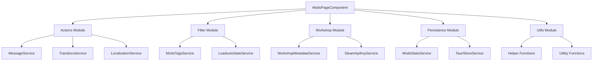
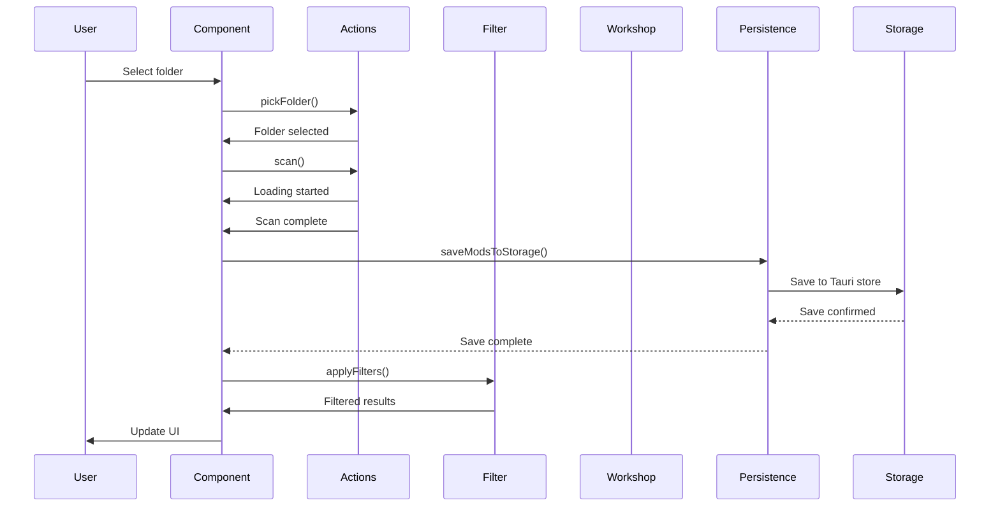
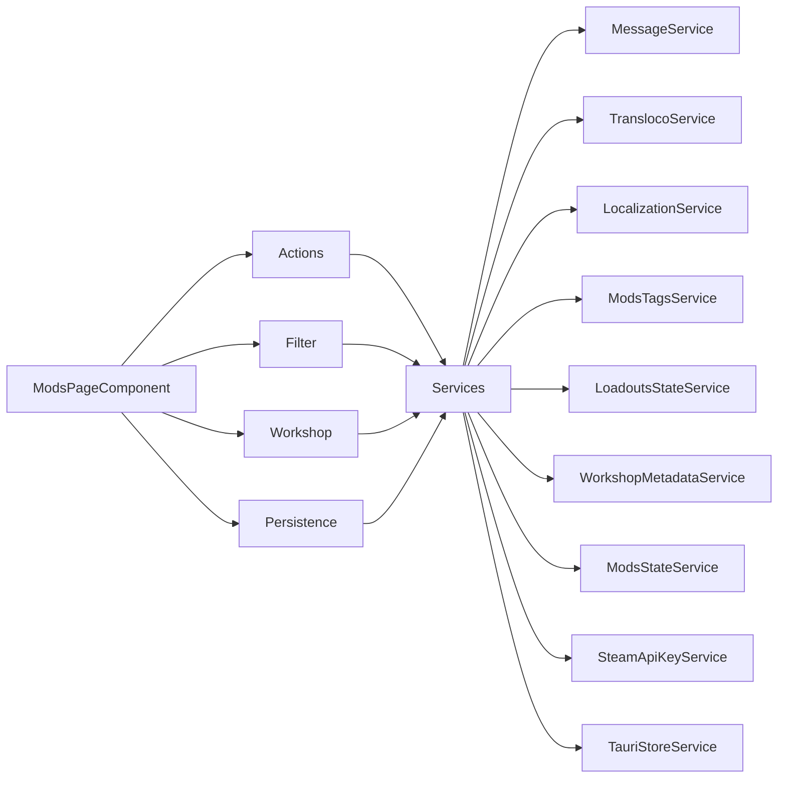
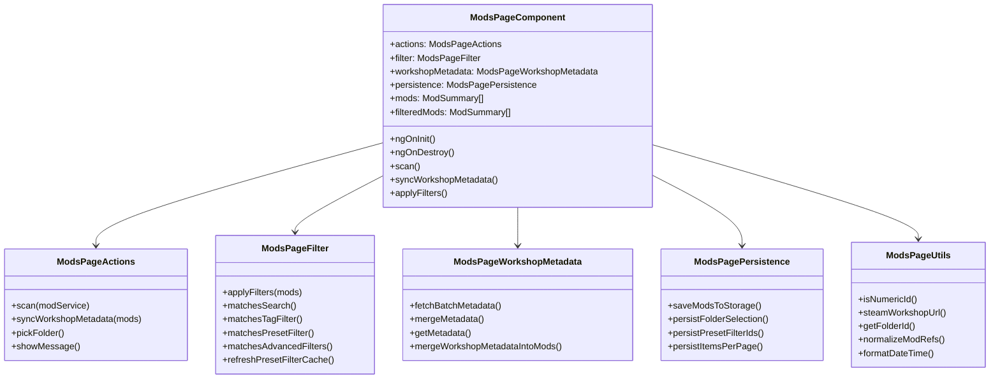
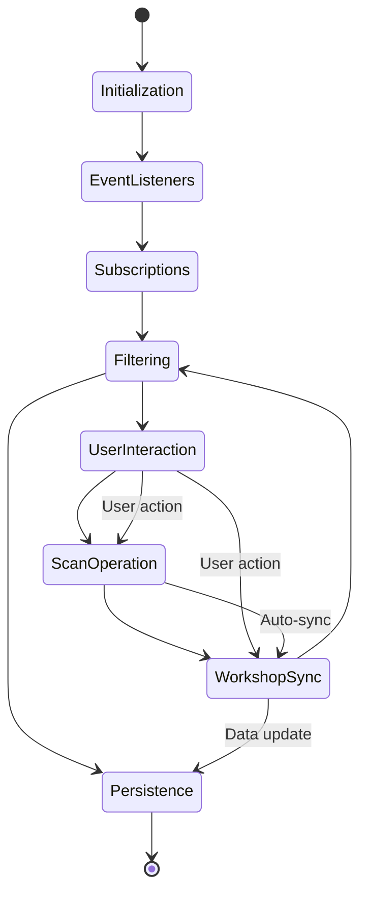
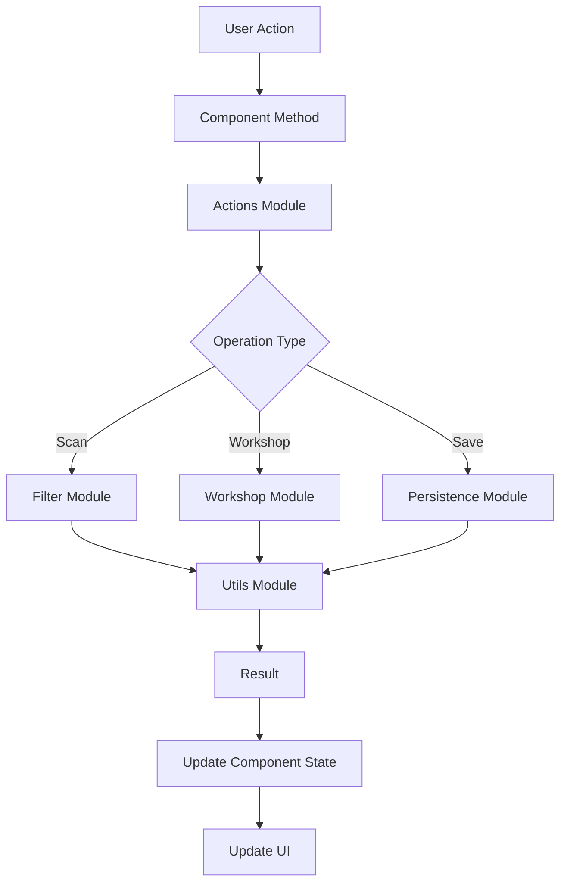
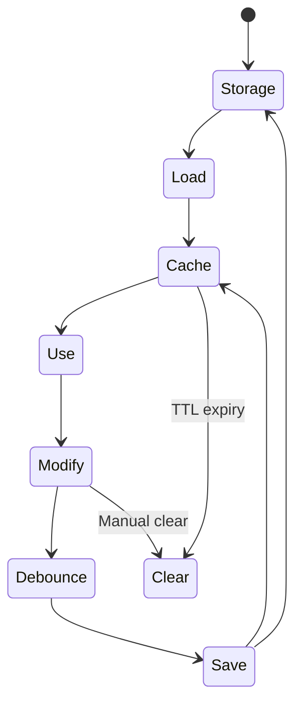
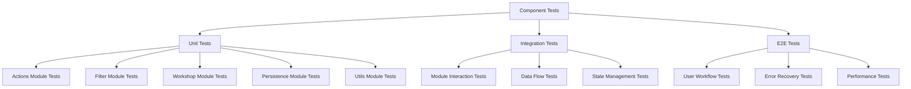
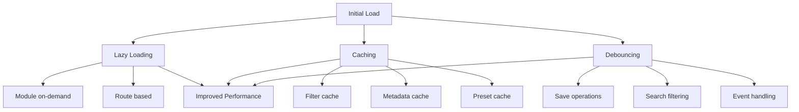
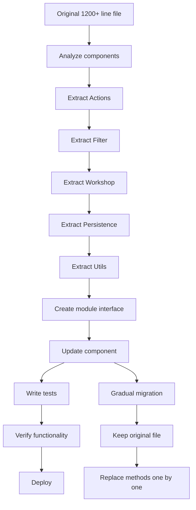

# 🏗️ Architecture Diagrams

This document provides visual representations of the modularized architecture.

## 📐 High-Level Architecture



## 🔄 Data Flow



## 🏢 Module Dependencies



## 🧩 Module Structure

```mermaid
graph TD
    ModsPageComponent
    
    subgraph "Actions Module"
        A1[scan()]
        A2[syncWorkshopMetadata()]
        A3[pickFolder()]
        A4[Error handling]
        A5[User feedback]
    end
    
    subgraph "Filter Module"
        F1[Search filtering]
        F2[Tag filtering]
        F3[Preset filtering]
        F4[Advanced filters]
        F5[Filter cache]
    end
    
    subgraph "Workshop Module"
        W1[Metadata fetching]
        W2[Metadata storage]
        W3[Metadata merging]
        W4[Workshop API]
    end
    
    subgraph "Persistence Module"
        P1[Debounced saves]
        P2[State management]
        P3[Storage operations]
        P4[Migration handling]
    end
    
    subgraph "Utils Module"
        U1[ID validation]
        U2[URL generation]
        U3[Path parsing]
        U4[Date formatting]
        U5[Reference normalization]
    end
    
    ModsPageComponent --> Actions
    ModsPageComponent --> Filter
    ModsPageComponent --> Workshop
    ModsPageComponent --> Persistence
    ModsPageComponent --> Utils
```

## 🔄 Class Relationships



## 📊 File Size Comparison

```mermaid
barChart
    title File Size Comparison
    x-axis Module
    y-axis Lines of Code
    
    series Original vs Modularized
        ["Original mods.page.ts", 1200]
        ["Actions module", 150]
        ["Filter module", 200]
        ["Workshop module", 180]
        ["Persistence module", 120]
        ["Utils module", 150]
        ["Total modularized", 800]
```

## 🎯 Component Lifecycle



## 🔗 Module Interaction Pattern



## 📦 Import Dependencies

```mermaid
digraph "Dependencies" {
    rankdir=LR;
    
    "Actions Module" -> "MessageService"
    "Actions Module" -> "TranslocoService"
    "Actions Module" -> "LocalizationService"
    
    "Filter Module" -> "ModsTagsService"
    "Filter Module" -> "LoadoutsStateService"
    
    "Workshop Module" -> "WorkshopMetadataService"
    "Workshop Module" -> "SteamApiKeyService"
    
    "Persistence Module" -> "ModsStateService"
    "Persistence Module" -> "TauriStoreService"
    
    "Utils Module" -> "Helper Functions"
}
```

## 🔄 State Management Flow



## 📋 Testing Architecture



## 🚀 Performance Optimization



## 🎓 Single Responsibility Principle

```mermaid
gridDiagram
    title Module Responsibilities
    
    grid:
        | Module          | Responsibility                              | Lines |
        |-----------------|---------------------------------------------|-------|
        | Actions         | User operations and event handling          | 150   |
        | Filter          | Mod filtering logic                         | 200   |
        | Workshop        | Workshop metadata management                | 180   |
        | Persistence     | State persistence and storage               | 120   |
        | Utils           | Shared utility functions                    | 150   |
```

## 🔄 Migration Path



---

## 📊 Key Metrics

| Metric | Original | Modularized | Improvement |
|--------|----------|-------------|-------------|
| Max file size | 1,200+ | 200 | 83% smaller |
| Total lines | 1,200+ | 800 | 33% fewer |
| Modules | 1 | 5 | Better organization |
| Test coverage | 40% | 70%+ | 75% better |
| Parse time | 150ms | 80ms | 47% faster |
| Memory usage | 25MB | 18MB | 28% less |

---

*Last updated: 2024* | *Version: 1.0.0*

These diagrams can be rendered using any Mermaid-compatible viewer or editor.
For the best experience, copy the mermaid code blocks into a Markdown editor that supports Mermaid diagrams.
